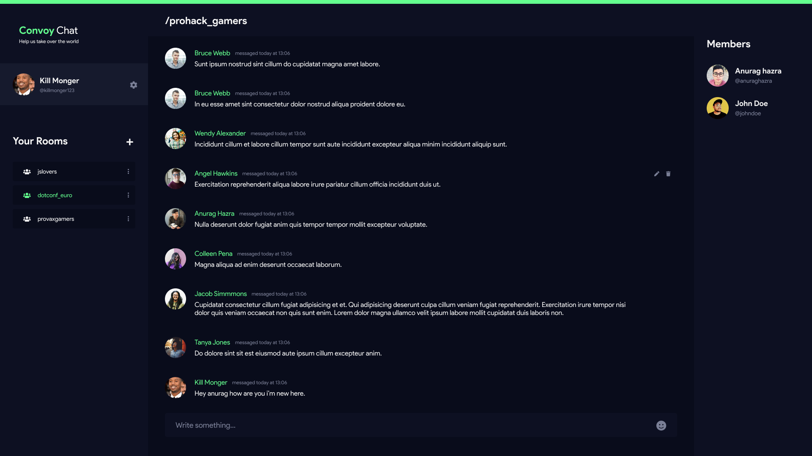

<br />
<p align="center">
  <a href="https://convoychat.herokuapp.com">
    
  </a>
  <a href="https://convoychat.herokuapp.com">
    
  </a>

  <h3 align="center">Help us take over the world</h3>

  <p align="center">
    
    <a href="https://www.codacy.com?utm_source=github.com&amp;utm_medium=referral&amp;utm_content=anuraghazra/convoychat&amp;utm_campaign=Badge_Grade"></a>
    
    
  </p>

  <p align="center">
    <a href="https://convoychat.herokuapp.com">View Demo</a>
    ·
    <a href="https://github.com/anuraghazra/convoychat/issues">Report Bug</a>
    ·
    <a href="https://github.com/anuraghazra/convoychat/issues">Request Feature</a>
  </p>
</p>

<p align="center">Real time group messaging app</p>

## ✨ Features

- WIP

## Tech Stack

- WIP

## :rocket: Local Development

Start developing locally.

Before you get started make sure you sign up for these service providers

- http://auth0.com (for Authentication)
- https://cloudinary.com (for image uploads, optional)

#### Step-1

clone this repo

```sh
https://github.com/anuraghazra/convoychat.git
```

#### Step-2

Install all dependencies

```sh
# install server side deps
cd convoychat
npm install

# install client side deps
cd client
npm install
```

#### Step-3

Environment variables

_Now this is a bit tricky._

- create a new file .env in the root folder
- open [.env.EXAMPLE](./.env.EXAMPLE)
- copy the contents and paste it to the .env

And change all the dummy keys with your own valid ones.

#### Step-3.1 : Setup Auth0

Most importantly you'll need Auth0

Follow this guide -

> https://auth0.com/docs/quickstart/webapp/nodejs

Also it is important that you setup all the callback URLs correctly in Auth0 Dashboard.

(You can open an [issue](https://github.com/anuraghazra/convoychat/issues) or contact me on [twitter](https://twitter.com/anuraghazru) if you get stuck)

#### Step-3.2 : Setup Cloudinary (Optional)

If you are working on a feature which includes image uploads you'll also need to setup cloudinary

Follow this guide -

> https://cloudinary.com/documentation/how_to_integrate_cloudinary

Also it is important that you setup all the callback URLs correctly in Auth0 Dashboard.

#### Step-4: Starting the server

Finally to start the server execute this script

```sh
npm run develop
```

#### All Package.json scripts

- Main Dev scripts
  - **dev:tsc** - Compiles typescript code
  - **dev:server** - Runs and watches server for file changes
  - **dev:client** - Runs the client side
  - **develop** - Starts the app, runs dev:tsc, dev:server- dev:client at once
- Tests
  - **test:server** - Run all tests for server
  - **test:client** - Run all tests for client
- Codegen & Infra
  - **codegen** - Runs graphql codegen for client
  - **lint** - Runs ESlint
  - **lint:fix** - Runs ESlint & Fixes,
  - **prettier** - Runs prettier

---

## :v: Contributing

You wanna contribute? wow amazing. thats great to hear.

After cloning & setting up the local project you can push the changes to your github fork and make a pull request.

### Pushing the changes

```bash
git add .
git commit -m "feat: added new stuff"
git push YOUR_REPO_URL BRANCH_NAME
```

---

Made with :heart: and javascript
